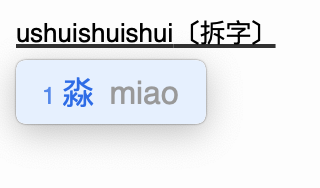

<div align="center">

</div>

# rime-chaizi
习惯了之前很多输入法的拆词功能，换到 Rime 后还有一点不适应。 搜索得知这一功能的实现往往会通过导入一个拆字词典来解决。但发现这一方案往往会在输入含 u 的拼音的时候出现卡顿。因此这个方案是有其缺陷的。 

根据 @lotem 大佬在这个 [讨论](https://github.com/rime/home/discussions/764) 下的提示，我意识到我们完全可以类似于五笔反查、两分输入来实现上述功能。 因此我修改了 [两分输入法](http://cheonhyeong.com/Simplified/download.html) 的方案，并尝试改为了 u 开头。

词典方面，参照 [gerry 老师](http://gerry.lamost.org/blog/?p=296003) 基于 [chaizi](https://github.com/kfcd/chaizi) 构建了拆字词典并做了去重和去除错误字符。

# 使用

## 直接使用

### 1. 下载 yaml

[Release](https://github.com/MaxChang3/rime-chaizi/releases) 下载 `chaizi.schema.yaml` 和 `chaizi.dict.yaml`，也可以自己下载完整项目构建。

### 2. 添加 Patch

例如，在朙月拼音中使用拆字，需要创建`luna_pinyin.custom.yaml`文件，然后贴入以下内容：

```yaml
# luna_pinyin.custom.yaml

patch:
  engine/translators/+:
     - reverse_lookup_translator
  schema/dependencies/+:
    - chaizi
  reverse_lookup:
    dictionary: chaizi
    enable_completion: true
    prefix: "u"
    tips: 〔拆字〕
    preedit_format:
      - xform/([nljqxy])v/$1ü/
    comment_format:
      - xform/([nljqxy])v/$1ü/
  recognizer/patterns/+:
      reverse_lookup: "u[a-z]*?$"
```

如果已经存在其它的 patch，则需要手工合并。

## 自行构建

```sh
git clone https://github.com/MaxChang3/rime-chaizi.git
cd rime-chaizi
```

```sh
curl https://raw.githubusercontent.com/kfcd/chaizi/master/chaizi-jt.txt --output chaizi-jt.txt
pip install -r requirements.txt
```

```sh
python build.py
cd src
```


# LICENSE
本仓库采用 MIT 协议。

改编原始文件 chaizi-jt.txt 采用 [CC BY 3.0](http://creativecommons.org/licenses/by/3.0/deed.zh_TW)


